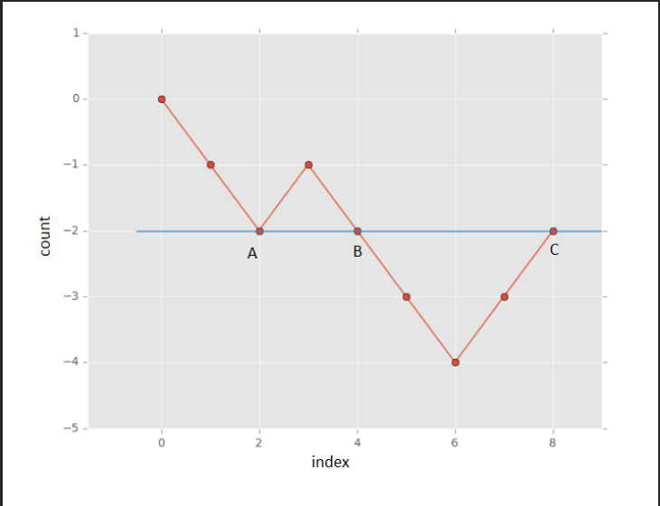

### Leetcode - 525 - [Continguous Subarray](https://leetcode.com/problems/contiguous-array/description/)

```cpp
class Solution {
public:
    int findMaxLength(vector<int>& nums) {
        int n = nums.size(), maxLenSubArray = 0 ;
        for(int i = 0 ; i < n ; ++i){
            int zeros = 0, ones = 0 ;
            for(int j = i ; j < n ; ++j){
                if(nums[j] == 0){
                    zeros++ ;
                }
                else{
                    ones++ ;
                }
                if(zeros == ones){
                    maxLenSubArray = max(maxLenSubArray, (j-i+1)) ;
                }
            }
        }
        return maxLenSubArray ;
    }    
};
```

> Time Complexity = O(N*N)

> Space Cpmplexity = O(1)

---

```cpp
class Solution {
public:
    int findMaxLength(vector<int>& nums) {
        int count = 0, n = nums.size() ;
        unordered_map<int, int> mp ;
        mp[count] = -1 ;
        int maxLenSubArray = 0 ;
        for(int i = 0 ; i < n ; ++i){
            if(nums[i] == 0){
                count-- ;
            }
            else{
                count++ ;
            }
            if(mp.find(count) == mp.end()){
                mp[count] = i ;
            }
            maxLenSubArray = max(maxLenSubArray, (i-mp[count])) ;
        }
        return maxLenSubArray ;
    }
};
```

> Time Complexity = O(1*N)

> Space Cpmplexity = O(1*N)

* This is an excellent qus of prefixSum.

> ### Explanation/Approach/Algorithm
>> Imagine a count variable, which is used to store the relative number of ones and zeros encountered so far while traversing the array. The count variable is incremented by one for every 1 encountered and the same is decremented by one for every 0 encountered. The following figure illustrates the observation for the sequence `[0 0 1 0 0 0 1 1]`:
>> 
>> #### We maintain a count variable to track the relative number of 1s and 0s while traversing the array.
>>> * Increment count by +1 for every 1.
>>> * Decrement count by −1 for every 0.
>> #### Key observations:
>>> * If count == 0 at any index i, it means the subarray from the start to index i has an equal number of 0s and 1s.
>>> * If the same count value is seen more than once, the elements between those indices contain an equal number of 0s and 1s.
>> #### To efficiently track these counts, use a hash map that stores:
>>> * Key: count value.
>>> * Value: the first index where this count occurred.
>> #### During traversal:
>>> * If the current count has been seen before, calculate the subarray length between the previous index and the current index.
>>> * If it’s the longest such subarray so far, update the maximum length.
>>> * If the count hasn’t been seen before, store the current index in the map.
>> #### The largest subarray with equal 0s and 1s is the one between the farthest apart indices with the same count value.