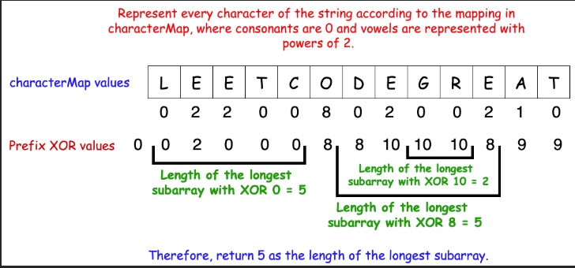

#### Leetcode - 1371 - [Find the Longest Substring Containing Vowels in Even Counts](https://leetcode.com/problems/find-the-longest-substring-containing-vowels-in-even-counts/description/)

😳 This problem is same as Leetcode 525, [Continguous Subarray](https://leetcode.com/problems/contiguous-array/description/). It's a good problem of combination of bitmasking and prefixSum.

```cpp
class Solution {
public:
    int findTheLongestSubstring(string s) {
        unordered_set<char> vowelSet = {'a','e','i','o','u'} ;
        unordered_map<char, int> vowelPosition = {{'a', 1},{'e', 2},{'i', 4},{'o', 8},{'u', 16}} ;
        unordered_map<int, int> lastOccuranceOfPrefixXor ;
        int prefixXor = 0, length = s.length(), maxLenStr = 0 ;
        lastOccuranceOfPrefixXor[prefixXor] = -1 ;
        for(int i = 0 ; i < length ; ++i){
            if(vowelSet.find(s[i]) != vowelSet.end()){
                prefixXor ^= vowelPosition[s[i]] ;
            }

            if(lastOccuranceOfPrefixXor.find(prefixXor) == lastOccuranceOfPrefixXor.end()){
                lastOccuranceOfPrefixXor[prefixXor] = i ;
            }
            else{
                maxLenStr = max(maxLenStr, (i-lastOccuranceOfPrefixXor[prefixXor])) ;
            }
        }
        return maxLenStr ;
    }
};
```

> Time Complexity = O(1*N)

> Space Cpmplexity = O(1*N)

> ### Approach/Algorithm
>> Observe that we don't need to know the exact count of the vowels to solve this problem; we only need to know the parity of each vowel (whether it appears an even or odd number of times). The parity of each vowel can be stored in a boolean or bit, where 0 means even and 1 means odd. We need five bits to track the parity of all five vowels `(a, e, i, o, u)`, resulting in `2`<sup>`5`</sup> = `32` possible states.<br>
>><br>
>> We can assign the first bit to a, the second to e, and so on. The state of the vowels can be represented as a binary string. For instance, `00000` means all vowels have even counts, while `00001` means only `a` has an odd count.<br>
>><br>
>>By converting these binary states to integers, we can assign values to the vowels: `a` = `1`, `e` = `2`, `i` = `4`, `o` = `8`, and `u`= `16`. If both a and i have odd counts, their total value would be `1` + `4` = `5`. A total value of `0` means all vowels have even counts.<br>
>> 
>> <br>
>> To find substrings with even vowels, we can use the XOR operator to update and track the parity of the vowels. If a vowel appears an even number of times, the result of XOR will be `0`; if it appears an odd number of times, the result will be 1.<br>
>> <br>
>> We compute a running `XOR` for each vowel as we traverse the string. To check for substrings with even vowels, we consider two cases:
>>> * If the current `XOR` value is `00000` (i.e., all vowels have even counts), the substring from the start of the string to the current position contains even vowels.
>>> * If the current `XOR` value has occurred before, the substring between the first occurrence of that `XOR` value and the current position also contains even vowels.
>>
>> 